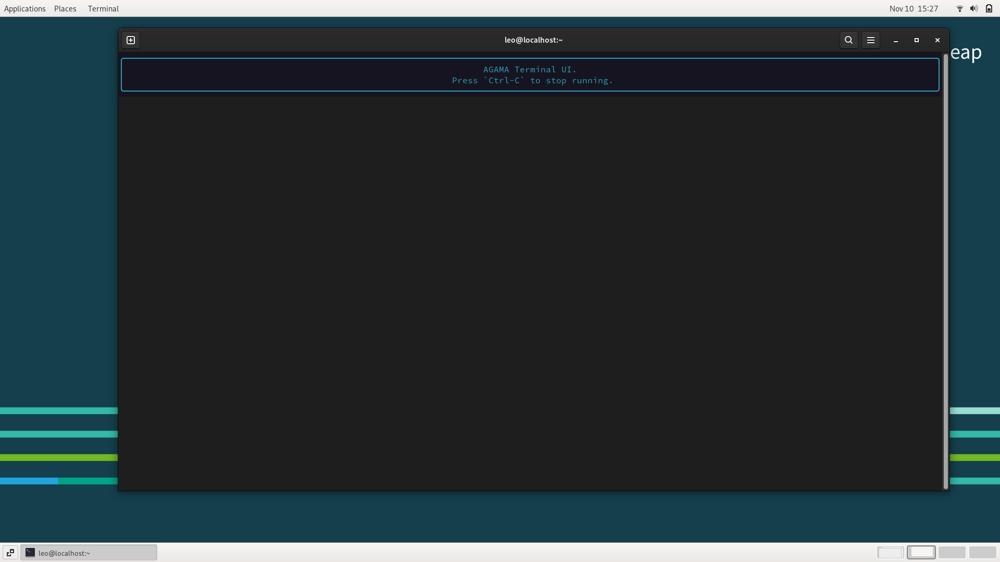
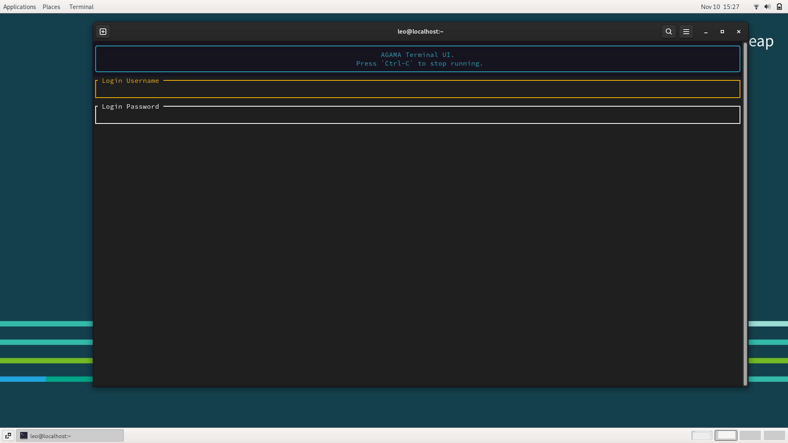
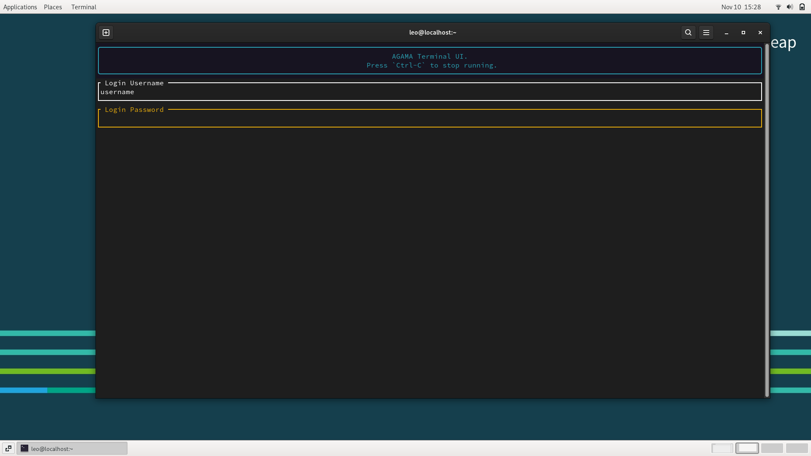
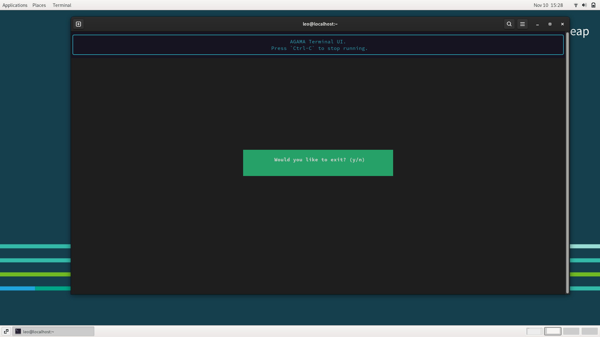

# HackWeek#23

`agama-terminal-ui`: **HackWeek#23** experiments

See Project: [TUI interface for Agama](https://hackweek.opensuse.org/23/projects/tui-interface-for-agama)

## Pictures

1. 
2. 
3. 
4. 
5. 
6. 
